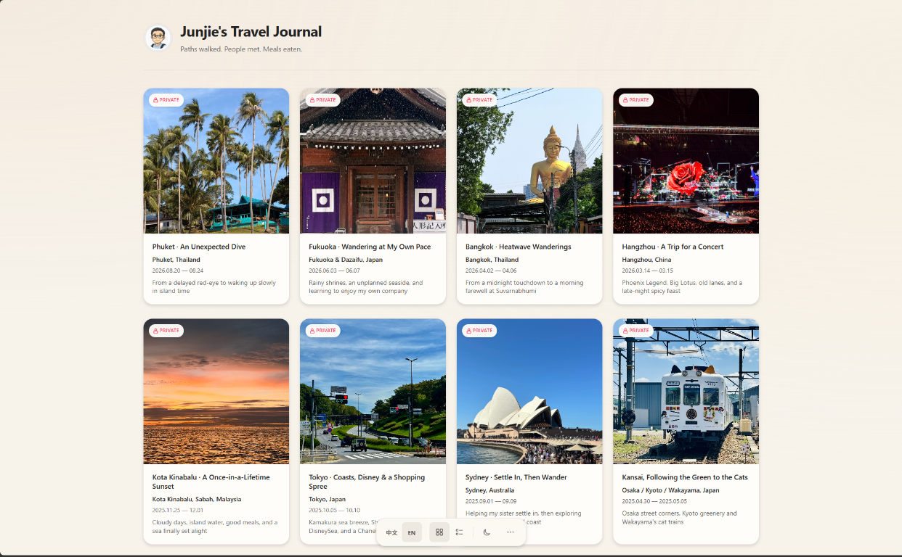

# Junjie's Travel Journal

路上的风景与小事，慢慢写下来。

  <a href="https://muyangamigo.github.io/travel-log/">
    
     
  </a>

## ✨ About

This is my personal travel journal — a quiet place for stories, photographs,
meals, wrong turns, small surprises, and honest impressions from the road.

Each journey is written in both **中文 and English**. Rather than presenting a
checklist of attractions, the journal follows each trip as it happened: where I
went, what I noticed, what I enjoyed, and what did not quite go to plan.

## 📸 The journal

<table>
  <tr>
    <td width="50%">
      <strong>Photography first</strong> 
      Places, food, architecture, and everyday moments set the pace of each story.
    </td>
    <td width="50%">
      <strong>Bilingual stories</strong> 
      Every entry is available in Chinese and English, with the same details and tone.
    </td>
  </tr>
  <tr>
    <td width="50%">
      <strong>Made for reading</strong> 
      Editorial layouts, chapter navigation, and responsive galleries create a calm reading experience.
    </td>
    <td width="50%">
      <strong>Personal by design</strong> 
      The journal keeps the prices, mishaps, disagreements, purchases, and candid opinions that make a trip real.
    </td>
  </tr>
</table>

## 🔒 A private space

The journal index is public, but the stories themselves are private. Protected
entries require an authorized Microsoft account or a private passcode before
they can be read.

The written pages are encrypted before they are published. Photographs are
hosted separately and are not covered by the same page encryption.

## 🧭 Behind the journal

The site is designed and built as a lightweight bilingual experience with:

- A warm, photography-led gallery
- Light and dark themes
- Layouts for desktop, tablet, and mobile
- Accessible keyboard navigation
- Encrypted private entries

It is built with Next.js and hosted on GitHub Pages, with photography stored in
Azure Blob Storage.

---

Paths walked. People met. Meals shared. | 走过的路，遇见的人，一起吃过的饭。

